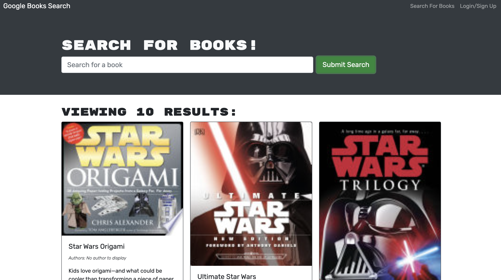
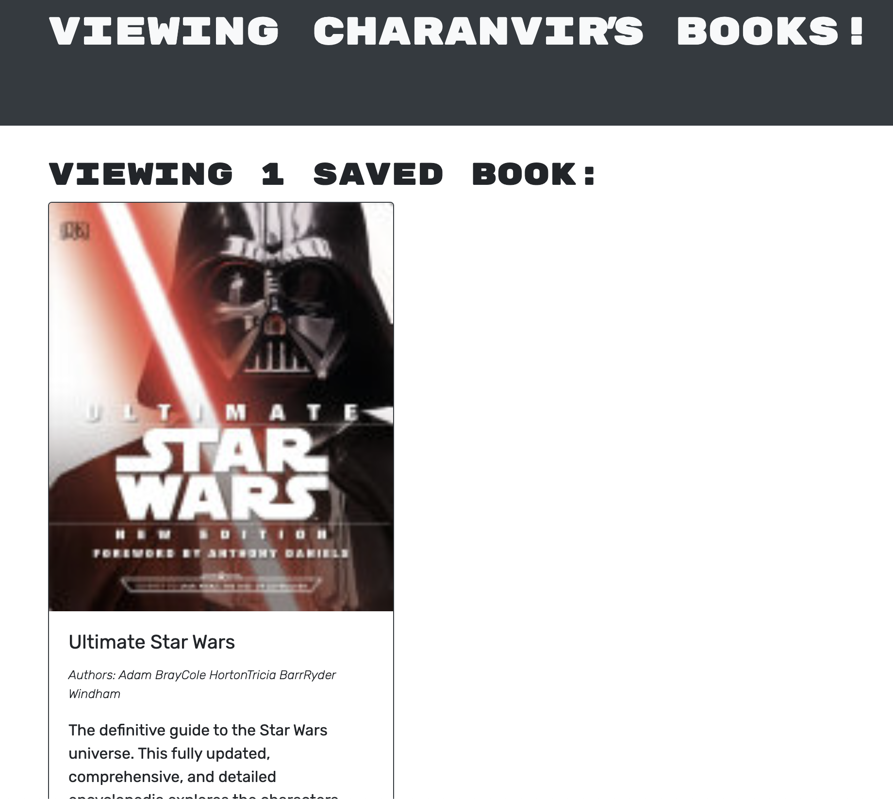

# Google Book Search

  

## <u>Table of Contents</u>
1. [Description](#description)
2. [Usage](#usage)
3. [Contributing](#contributing)
4. [Questions](#questions)
5. [License](#license)

## Description
***

Google Book Search is an application that allows users to search up books using the Google Books API. Users are able to create an account save their favorite books. They can return to the application on a later time and the saved books will persist.

Google Book Search is a MERN-stack application, which utilizes React for the frontend, and Mongoose and GraphQL for the backend. 

## Usage
***

To use this application, visit the deployed application via Heroku and start searching!

The following images show the application being used: 

 

***

***

The following is a link to the deployed application: [Google Book Search](https://rocky-mesa-43378.herokuapp.com/) 

## Contributing
***

To contribute to this application, push any enhancements and changes you code and send an email to charanvir123@gmail.com. The developer will get back to you if they wish to implement any of the code changes you've made. 

## Questions
***
To view more projects visit my [Github](https://github.com/Charanvir) account.

Direct any additional questions you have regarding this application to charanvir123@gmail.com

## License
***
The following application is covered under the MIT License
